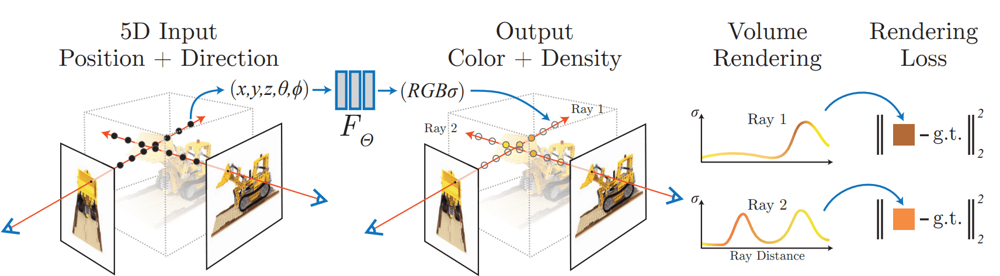
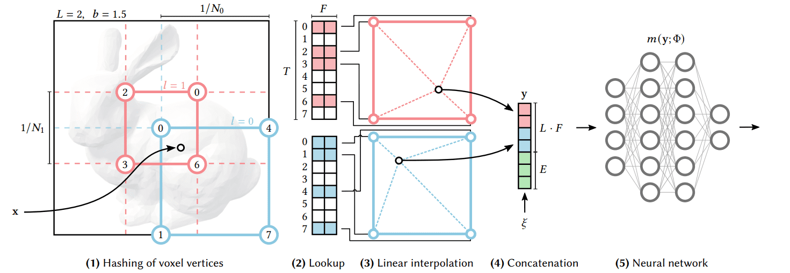

# Neural Radiance Fields with a Multi-Resolution Hash Encoding

(Still working on finishing the project)
This project is an implementation of a Neural Radiance Field pipeline with a Multiresolution Hash Encoding. The model takes as input, 5 Dimensional values and produces 3D-rendered images by volume rendering. This repository supports training NeRF models on datasets generated with **COLMAP** using your own images.



## Project Overview

NeRF is a method for generating novel views of complex 3D scenes or 3D objects by training a Feed Forward Network (MLP) to optimize over a volumetric scene function. The implementation involves:
- An MLP to output RGB and density values by processing the 5 dimensional input.
- Multiresolution hash encoding.

### Features

- **Structured Input.** The 5D input is not just available to be fed into the network, the data that is ultimately fed into the network is not what is available i.e. the raw pixel's RGB value and a transformation matrix. The transformation matrix conveys the orienation of the camera that shot that particular image, using this transformation matrix we can generate the theta and phi values required to feed into our MLP.  

- **Multi Layer Perceptron** that takes in the RGB, theta and phi values for every pixel in every image in the dataset as input and outputs RGB and volume opacity values for the relevant coordinates in the 3D space.

- **Volume rendering** to synthesize images by integrating through a learned 3D space. This is done by projecting rays from every pixel in every image. For each of these rays we sample points along those rays where we have RGA and volume opacity values generated using the MLP. Integrating the color and density values along these rays gives us the predicted RGB value for that particular pixel. Once we have the predicted values for the entire batch, the mean squared loss is taken to optimize the MLP.

- **Multiresolution Hash Encoding** based on Instant NGP. This has to shown accelerate learning. Instead of storing and learning for every voxel in the 3D space, grids over multiple levels of resolution are used to map voxels to feature vectors using hash tables. Fine and Coarse (Multiresolution) grids are employed to map intricate or global features that are relevant to the current grid using the hash tables. This approach significantly reduces the parameter footprint of the MLP whilst splitting the learning between the MLP and the hash tables.





- **COLMAP dataset compatibility** for easy integration with 3D scanned or photogrammetry-based datasets.


## Dataset and Preprocessing

This NeRF pipeline is compatible with datasets in the format used by COLMAP. To use your own dataset:
1. Capture images of your scene and process them with COLMAP to get camera poses.
2. Generate a `transforms.json` file that contains:
   - `camera_angle_x`: Horizontal field of view of the camera.
   - `frames`: List of frames with their corresponding camera poses.
   - `transform_matrix`: Transformation matrix for each frame.

Ensure that the `transforms.json` file is located in the dataset directory.

## Installation

1. Clone the repository:

   ```bash
   git clone https://github.com/R2D2-08/NeRF.git
   cd NeRF

## References 

1. Mildenhall, Ben, et al. [NeRF: Representing Scenes as Neural Radiance Fields for View Synthesis](https://arxiv.org/abs/2003.08934). arXiv, 3 Aug. 2020

2. Müller, Thomas, et al. [Instant Neural Graphics Primitives with a Multiresolution Hash Encoding](https://arxiv.org/abs/2201.05989v2). ACM Transactions on Graphics, vol. 41, no. 4, July 2022, pp. 1–15
